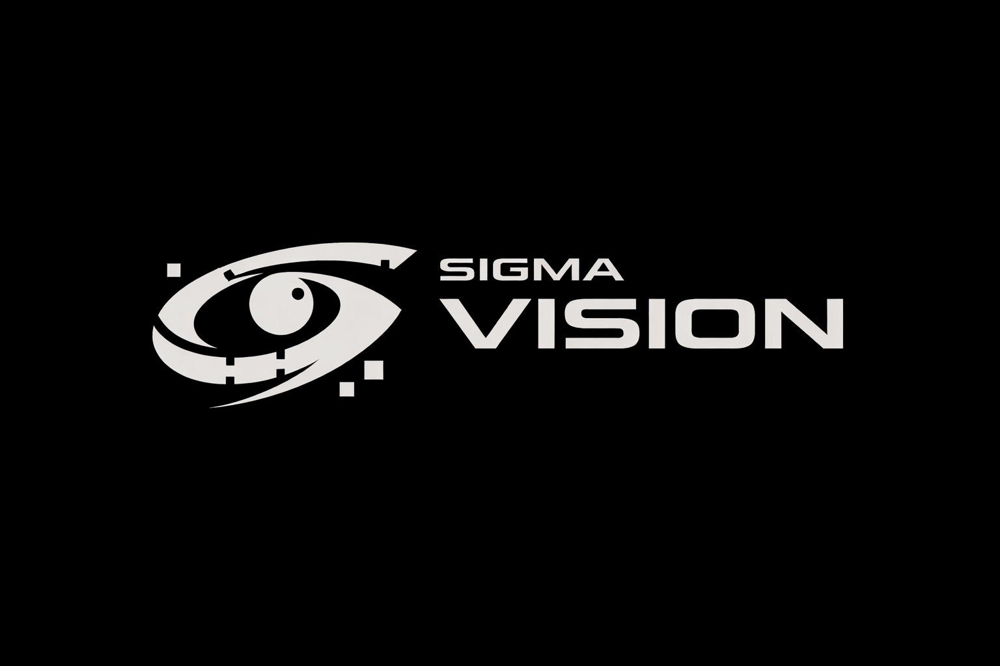
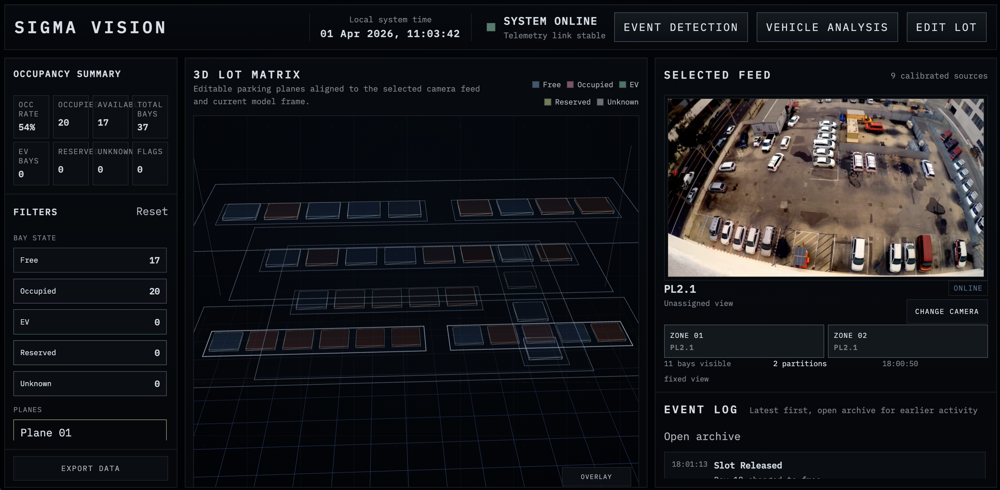
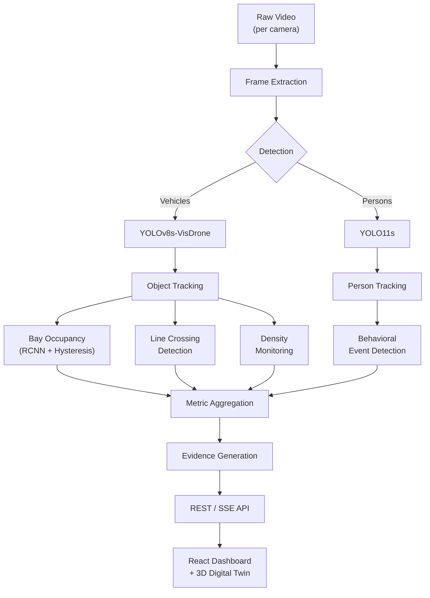
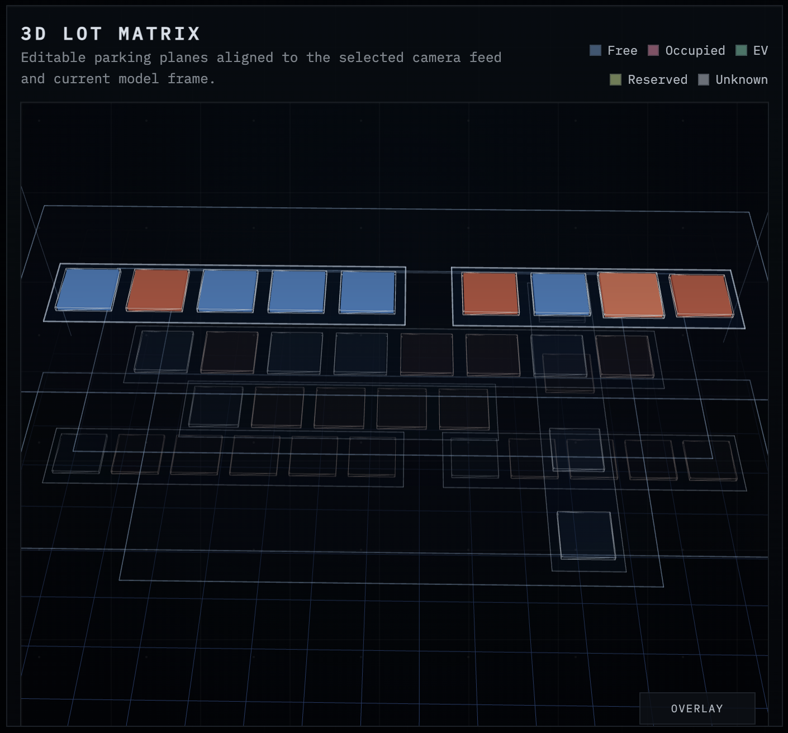
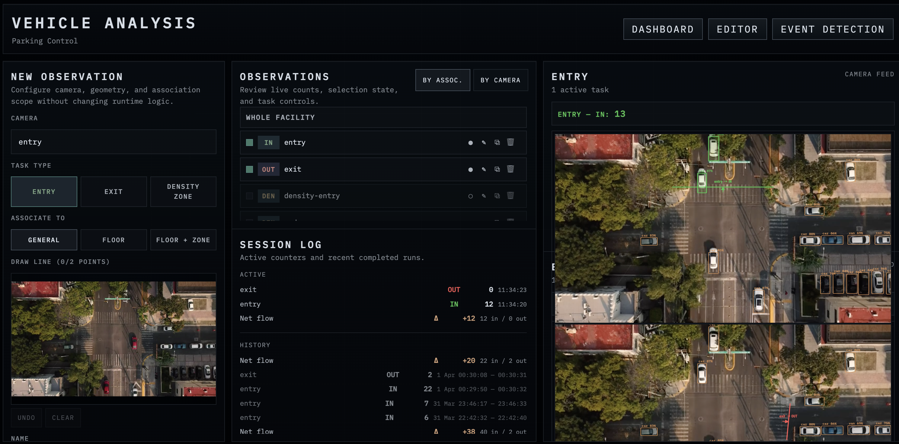
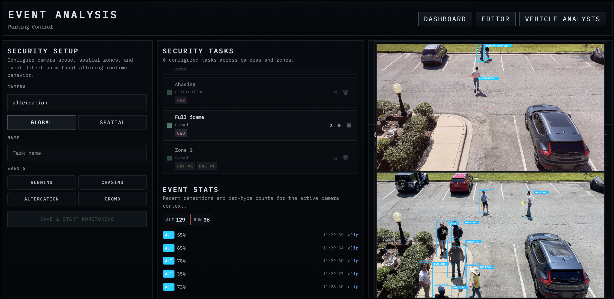
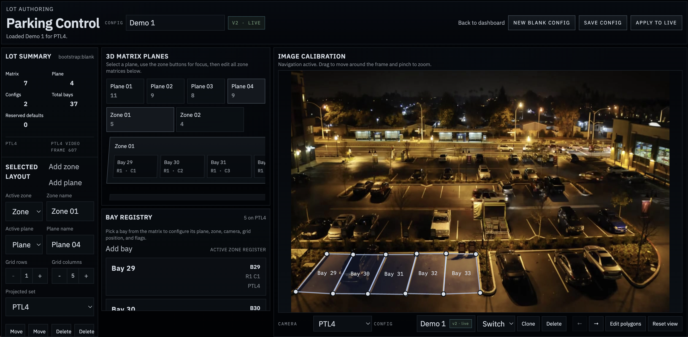

<p align="center">
  
</p>

<h1 align="center">Sigma Vision</h1>

<p align="center">
  <em>Turn hours of parking footage into actionable moments — recognize events, save time.</em>
</p>

<p align="center">
  
</p>

<p align="center">
  Beantech Spring Hackathon 2026 · Challenge 2: From Video to Value
</p>

<p align="center">
  
  
  
  
  
  
  
</p>

<p align="center">
  <strong>Lorenzo Di Bernardo</strong> · UNITS-AIDA &nbsp;|&nbsp;
  <strong>Giovanni Mason</strong> · UNIVE &nbsp;|&nbsp;
  <strong>Lorenzo Gobbo</strong> · UNIPD
</p>

---

## What Sigma Vision Does

Parking facilities generate thousands of hours of surveillance footage monthly. Almost none of it is analyzed. Operators waste entire shifts scrubbing recordings to find a single incident. Traditional ERPs handle billing but are blind to what actually happens in the lot — queue formation, grace-time violations, altercations, wrong-way maneuvers.

**Sigma Vision watches the video so operators don't have to.** It ingests multi-camera parking footage, runs real-time vehicle detection and tracking, computes occupancy and traffic metrics, detects behavioral security events, and presents everything through an interactive dashboard with a 3D digital twin. What previously required 3–4 hours of manual review takes minutes.

This is not a notebook. It is a working full-stack application that processes video in real time during the live demo.



---

## Demo

Everything runs live on one machine. No pre-recorded results, no pre-computed metrics.

1. **`/live`** — 3D twin updating live. Click any bay for detail card (status, confidence, dwell time). Switch cameras. Filter by zone or level.
2. **`/analysis`** — Draw a counting line on the camera feed. Toggle it on. Watch vehicles cross — counter increments in real time.
3. **`/events`** — Create a security task with a zone. Event badges flash as behaviors are detected. Download a 5-second evidence clip.
4. **`/live`** — Return to facility metrics. Browse event archive. Export to CSV.

---

## Quick Start

### Docker (recommended)

```bash
git clone https://github.com/diiibe/Sigma-Vision.git && cd Sigma-Vision
docker compose up demo
# Open http://localhost:5173
```

The Docker image includes pre-baked demo state: videos, model weights, spatial configurations, and sample events. Everything works out of the box.

### Local Development

```bash
# 1. Clone and install frontend
git clone https://github.com/diiibe/Sigma-Vision.git && cd Sigma-Vision
npm install

# 2. Python environment
python3 -m venv .venv && source .venv/bin/activate
pip install -r backend/requirements.txt

# 3. Place assets
#    - .mp4 video files in demo/videos/
#    - YOLOv8s-VisDrone weights in backend/model/yolov8s_visdrone.pt
#      (from HuggingFace: mshamrai/yolov8s-visdrone)

# 4. Run full stack
npm run dev:demo
# Frontend: http://localhost:5173 — Backend: http://localhost:8000
```

<details>
<summary><strong>Environment Variables</strong></summary>

| Variable | Default | Description |
|---|---|---|
| `HACK26_STATE_DIR` | `backend/state` | Root directory for config + runtime storage |
| `HACK26_DEMO_ASSETS_DIR` | `demo/` | Path to demo videos and lot definition |
| `HACK26_CORS_ORIGINS` | `http://localhost:5173` | Allowed CORS origins |
| `HACK26_BOOTSTRAP_LAYOUT` | `blank` | Initial layout mode (`legacy` or `blank`) |
| `DEMO_MODE` | `0` | Enable demo mode with pre-baked state |

</details>

<details>
<summary><strong>Setup Notes</strong></summary>

- **Model weights** are not included in the git repository (too large). The RCNN weights (~90 MB) are downloaded automatically during Docker build. For local dev, place `yolov8s_visdrone.pt` in `backend/model/`.
- **First run** may be slow — ffmpeg extracts frames from video files and caches them as JPEGs. Subsequent runs are fast.
- **CPU-only** by default. No GPU required. YOLOv8s runs at ~48ms/frame on CPU.
- **YOLO11s** weights (`yolo11s.pt`) for the security module are included in the repository root (19 MB).

</details>

---

## Challenge Alignment

### Required Metrics — All Implemented

| Required Metric | Implementation | Where to See It |
|---|---|---|
| **Vehicle count** | YOLOv8s-VisDrone detection per frame, tracked with Hungarian matching. Per-zone and facility-wide counts. | Dashboard analytics panel, `/analysis` live feed |
| **Real-time occupancy** | Per-bay ResNet50 RCNN with ROI pooling, stabilized by hysteresis FSM (N-frame confirmation before state change). Zone and facility rollups each cycle. | 3D digital twin, dashboard occupancy rate |
| **Average dwell time** | Derived from occupancy state transitions: timestamps logged at OCCUPIED→FREE. Duration = difference between transitions. | Bay detail cards, event history |
| **Entry/exit counts** | User-defined counting lines with directional crossing via centroid trail analysis (8-frame history). Events logged with track ID, timestamp, confidence. | `/analysis` counters, `/counting` timeline, CSV export |

### Bonus Areas Addressed

| Bonus Area | Coverage |
|---|---|
| **Advanced analytics** | Trajectory tracking (centroid trails), density zone monitoring with temporal smoothing |
| **Evolved insights** | Occupancy overlay heatmaps (dwell patterns, turnover), congestion detection, threshold-based alerting (capacity, flow rate, net flow) |
| **Multi-camera** | Per-camera independent threads, facility-wide aggregation, camera switching in UI. |
| **AI readiness** | CPU-only inference, ONNX-exportable models, SQLite (no DB server). |
| **Privacy-by-design** | Event-driven storage (clips, not continuous video), no facial recognition, no individual identification, configurable retention limits, GDPR data minimization |

---

## Architecture

### End-to-End Pipeline



### Three Functional Modules

All modules share spatial configuration and camera infrastructure but run **independent processing pipelines** with dedicated threads, models, and state.

---

#### Module 1 — Live Occupancy Dashboard (`/live`)




**What it shows:**
- **Left — Analytics:** Occupancy rate, slot breakdown (occupied/free/EV/reserved/unknown) with toggle filters, zone and level selectors, CSV export.
- **Center — 3D Digital Twin:** The parking facility rendered as stacked 3D layers. Each bay is a colored cube — blue (free), orange (occupied), green (EV), yellow (reserved). Click any bay to open a detail card showing status, confidence, dwell time, camera, and action buttons (reserve, track, clear override). Orbit controls for pan/zoom/rotate. Toggle overlay heatmaps: occupancy dwell (how long bays stay occupied) and vehicle turnover (how frequently bays change state).
- **Right — Monitoring:** Live camera feed with SVG polygon overlays color-coded by bay state. Camera switching. Event log with severity badges and timestamps. "Open archive" for full paginated event history with scope filtering.

**Workflow:** Open the app — the dashboard is already live. The backend scheduler advances frames, runs detection, tracking, and RCNN classification in a background loop. The frontend polls snapshots and renders updates. No manual action needed: the operator sees the facility state at a glance and drills into anomalies as they appear.

---

#### Module 2 — Vehicle Analysis & Counting (`/analysis`, `/counting`)



The operator creates observation tasks — pairing a camera with a specific measurement (counting line or density zone) drawn directly on the camera image.

**Workflow — step by step:**

1. **Select a camera** from the dropdown — the live frame appears as the editing canvas.
2. **Draw an observation.** For entry/exit counting: click two points on the image to define a counting line, name it, assign a direction. For density monitoring: click 3+ points to define a polygon zone, set a capacity threshold.
3. **Start the task.** Toggle the observation on. The backend spawns a dedicated counting thread for that camera — running YOLO detection and Hungarian tracking at native framerate, independent of the occupancy pipeline.
4. **Watch the model work.** The live feed shows YOLO bounding boxes overlaid via SVG — yellow by default, green when a vehicle crosses an entry line, red on exit. Counters update in real time as crossings are detected.
5. **Run multiple tasks.** Up to 2 simultaneous tasks on the same camera (or different cameras). A single `<video>` element is cloned to `<canvas>` elements via `requestAnimationFrame` — zero additional network or decode cost.
6. **Review results.** Session log shows active and completed counting sessions with timestamps, entry/exit totals. The `/counting` page provides aggregate views: hourly timeline chart, net flow indicators, recent crossing events with IN/OUT badges, track IDs, and confidence scores.

**Key design choice:** Counting tasks run in their own thread with zero DB writes during ticks — events accumulate in memory and flush on session stop. This keeps the counting loop at 10–22 FPS on CPU without I/O contention.

---

#### Module 3 — Security Event Detection (`/events`)



The operator creates security tasks — pairing a camera with one or more monitoring zones and selecting which behaviors to detect.

**Workflow — step by step:**

1. **Select a camera** — typically a security-specific camera feed (e.g., entrance corridor, restricted area).
2. **Define zones.** Draw polygonal zones on the camera image. Each zone can independently enable/disable detection types: running, chasing, altercation, crowd gathering, zone entry, dwelling. Thresholds (speed, proximity, dwell time) are configurable per zone.
3. **Start the task.** The backend spawns a dedicated security thread for that camera — running YOLO11s person detection, Hungarian tracking, and the behavioral FSM engine on every frame.
4. **Watch the live feed.** Person bounding boxes appear on the video. When the FSM detects a behavior, an **event badge** flashes on the feed — color-coded by type (red = running, orange = chasing, pink = altercation, purple = dwelling, yellow = zone entry, magenta = crowd gathering).
5. **Review events.** Per-task counters show running totals by event type. The event list logs every detection with timestamp, zone, involved tracks, and confidence.
6. **Download evidence.** From any event in the list, download a **5-second video clip** centered on the event timestamp — extracted via ffmpeg. This is the core value proposition: the operator gets precisely the clip they need, with full contextual metadata, without scrubbing through hours of footage.

**Key design choice:** Each camera's security pipeline runs in its own thread with its own SQLite database, fully independent from the occupancy and counting pipelines. Multiple security tasks can monitor the same camera with different zone configurations.

---

#### Spatial Configuration Editor (`/config`) and the 3D Digital Twin



The editor is the foundation that shapes the entire system. Every bay polygon, counting line, and zone drawn in the editor drives both the backend analysis and the 3D visualization.

**How the editor works:**

1. **Select a camera** — its live frame becomes the editing canvas.
2. **Draw bays (parking spots)** as quadrilateral polygons directly on the camera image. Assign each bay to a zone and a level (floor). These polygons define the ROIs that the RCNN model classifies as occupied or free.
3. **Draw counting lines** as directed line segments — these become the entry/exit detection boundaries for the counting engine.
4. **Draw density zones** as polygons — these become the containment regions for the density monitoring engine.
5. **Save and version.** Configurations are stored as versioned JSON files. You can save drafts, compare versions, and activate a specific version — the live pipeline picks up the change instantly without restart.
6. **Manage presets.** Clone configurations between cameras, create templates for common layouts.

**How the editor shapes the 3D digital twin:**

The 3D scene is not a static model — it is **generated programmatically from the spatial configuration**. The relationship is direct:

- Each **bay polygon** drawn in the editor becomes a **3D cube** in the scene, positioned according to its centroid in normalized coordinates.
- Each **zone** groups bays visually and aggregates their occupancy metrics.
- Each **level** (floor) becomes a **stacked horizontal layer** in the 3D view. The user assigns bays to levels in the editor, and the scene renders them as vertically separated planes — creating the multi-story parking visualization.
- **Bay colors** in the 3D scene reflect real-time RCNN classification results: the backend classifies each bay using the polygons defined in the editor, and the frontend maps the occupancy state to colors (blue = free, orange = occupied, green = EV, yellow = reserved).
- **Heatmap overlays** (dwell time, turnover rate) are computed from the temporal history of bay state transitions — which only exist because the editor defined those bays in the first place.

In short: **draw the lot in 2D on the camera image → the 3D twin materializes automatically → the AI fills it with live data.** The editor is the single source of truth for the facility's geometry, and every other component — occupancy classification, counting, density monitoring, 3D visualization, metric aggregation — derives from it.

### Threading Model (GIL-Safe)

| Thread | Role | I/O Pattern |
|---|---|---|
| HTTP (FastAPI/uvicorn) | Serves REST and SSE, reads cached state | No heavy compute |
| Scheduler | Frame advance, occupancy pipeline, snapshot persistence | Skipped when counting/security active |
| Counting (per session) | YOLO + tracker + line crossing at native FPS | Zero DB writes during ticks |
| Security (per camera) | YOLO person + tracker + behavioral FSM | Own SQLite database |

No explicit locks on the counting hot path — Python's GIL guarantees atomic dict assignment. This design allows the counting loop to sustain **10–22 FPS on CPU**.

---

## Models and Technical Choices

### Vehicle Detection: YOLOv8s-VisDrone

| Model | Params | mAP@0.5 | Decision |
|---|---|---|---|
| YOLOv8n-VisDrone | 3.2M | 0.341 | Too low accuracy |
| **YOLOv8s-VisDrone** | **11.2M** | **0.408** | **Selected — best accuracy/speed for real-time CPU** |
| YOLOv8m-VisDrone | 25.9M | 0.454 | Marginal gain, 2× slower |
| YOLOv8x-VisDrone | 68.2M | 0.470 | Best accuracy, 4× slower |

We also trained a YOLO11s variant on VisDrone (5 epochs, batch 4, 640×640, Apple Silicon MPS). Weights preserved in the repository for comparison.

**Why VisDrone, not COCO?** Parking cameras are mounted high and angled down — closer to drone footage than street-level images. We tested YOLO11s with COCO weights on our parking footage: near-zero valid detections. Cars were classified as "train," "cell phone," "suitcase." The domain shift is fundamental, not tunable. Documented in [`notebooks/yolo_coco_baseline.ipynb`](notebooks/yolo_coco_baseline.ipynb).

**Why YOLOv8s, not heavier?** Live analysis at 5 FPS requires ≤200ms/frame. YOLOv8s runs at ~48ms/frame on CPU, leaving headroom for tracking and spatial logic. Lower per-frame confidence is compensated by temporal stabilization: a single false negative doesn't trigger a state change — only sustained disagreement does.

### Person Detection: YOLO11s-COCO

The security module detects persons using YOLO11s with COCO weights, filtered to the person class. Unlike vehicles, COCO's person class generalizes well to overhead perspectives — people look similar from any angle.

### Occupancy Classification: ResNet50 RCNN

Binary classification per bay (occupied/free). ResNet50 backbone with ROI pooling at 128×128. Trained on PKLot and CNRPark+EXT datasets.

**Hysteresis FSM** requires N consecutive frame confirmations before toggling a bay's state. This eliminates flicker from shadows, partial occlusions, and transient false detections. The trade-off: a brief delay before state changes propagate — acceptable for a slow-changing environment.

### Tracking: Hungarian Matching

Custom implementation using `scipy.optimize.linear_sum_assignment`. Cost = weighted centroid distance + IoU. Track buffer: 30 frames.

**Why not DeepSORT?** Parking lots have low object density (5–30 vehicles per camera) and predictable motion. IoU + centroid provides sufficient discrimination without the overhead of a re-identification CNN. O(n³) assignment is manageable at this scale.

### Behavioral Event Detection: FSM Composition

Six behavior types detected from spatial and temporal primitives:

| Behavior | Detection Logic | Key Thresholds |
|---|---|---|
| Running | Speed above threshold for N consecutive frames | speed > 0.012, 3 frames |
| Chasing | Two tracks in proximity, both moving fast | proximity < 0.15, speed > 0.004 |
| Altercation | Multiple tracks very close together, moving | proximity < 0.08 |
| Zone entry | Centroid transitions from outside to inside a polygon | Ray-casting |
| Dwelling | Track remains inside zone beyond time threshold | 10 seconds |
| Crowd gathering | 3+ persons detected inside a zone simultaneously | count ≥ 3 |

**Why FSM composition instead of end-to-end video classification?** Composing behaviors from primitives (speed, proximity, containment) provides: explainability (each detection traces to specific tracks and thresholds), per-zone configurability (different thresholds for different areas), and evidence-linked clip extraction. The trade-off: interaction-based behaviors rely on proximity and motion — the system cannot disambiguate visually similar interactions (e.g., a hug vs. an assault) without pose estimation.

---

## Baseline Comparison

We define two baselines to contextualize what Sigma Vision adds over simpler approaches:

| Capability | Baseline A: COCO YOLO | Baseline B: Naive Counter | Sigma Vision |
|---|---|---|---|
| Overhead vehicle detection | Fails — near-zero valid detections | Requires VisDrone weights | mAP@0.5 = 0.408 |
| Stable occupancy | N/A | Flickers frame-to-frame | Hysteresis FSM (N-frame confirmation) |
| Entry/exit counting | N/A | Double-counts at boundaries | Trail-validated + cooldown (5 frames) |
| Behavioral event detection | N/A | N/A | 6 event types via FSM |
| Evidence clips | N/A | N/A | 5-second ffmpeg extraction |
| Interactive dashboard | N/A | N/A | 3D twin + live feeds + analytics |

**Baseline A — COCO YOLO (no domain adaptation):** Near-zero valid detections on parking footage. Cars classified as "train," "TV," "cell phone." This demonstrates that domain adaptation is a necessity, not an optimization. Documented in [`notebooks/yolo_coco_baseline.ipynb`](notebooks/yolo_coco_baseline.ipynb).

**Baseline B — Naive counter (no tracking, no temporal logic):** Per-frame detection without tracking would cause occupancy flicker, double-counting at boundaries, and no ability to measure dwell time or detect behavioral events.

**A note on honesty:** We do not fabricate quantitative accuracy metrics. We lack ground-truth annotations for our demo footage, so we cannot report precision/recall on the target domain. The live demo is the evidence: judges can verify that vehicles are detected, crossings are counted, and behaviors are flagged by watching the system operate. Model comparison with quantitative results is documented in [`notebooks/model_comparison.ipynb`](notebooks/model_comparison.ipynb).

---

## Datasets

| Dataset | Usage | Scale | Perspective |
|---|---|---|---|
| **VisDrone 2019** | YOLO vehicle detection training | ~8,629 images (6,471 train / 548 val / 1,610 test) | Aerial / drone |
| **PKLot + CNRPark+EXT** | RCNN occupancy classification training | Binary (occupied/free) per bay | Fixed overhead |
| **CHAD** (UNC Charlotte) | Behavioral analysis — security event calibration | Multi-camera video with crowd and activity annotations | Fixed surveillance |
| **Demo videos** | Live demo feeds | MP4 recordings from parking facilities | Surveillance cameras |

The **CHAD dataset** (Crowd Human Activity Detection, UNC Charlotte) was used to calibrate and validate the behavioral event detection module. Its multi-camera surveillance footage with crowd activity provided reference scenarios for tuning the FSM thresholds — running speed, chasing proximity, crowd gathering density — against real human behavior patterns in monitored environments.

**Data caveats:**
- VisDrone drone viewpoints vary more than fixed parking cameras — a generalization gap exists.
- VisDrone scenes are from Chinese cities; vehicle distributions differ from European contexts.
- No nighttime footage in the training set.
- PKLot and CNRPark are from fixed overhead cameras — closer to target domain for occupancy, but different facilities.
- CHAD scenes are from university campus environments — behavioral patterns may differ from parking-specific contexts.

**Dataset-agnostic pipeline:** Any MP4 file placed in `demo/videos/` is automatically discovered and processed. The challenge-recommended DLP and CHAD datasets require only file placement and spatial configuration drawing.

---

## Known Limitations

**Model**
- YOLOv8s-VisDrone trained on aerial drone footage, not fixed parking cameras — a generalization gap exists between training and deployment perspectives.
- No nighttime data in the training set. Performance under low-light conditions is unknown.
- Behavioral detection cannot disambiguate visually similar interactions (hug vs. assault) without pose estimation.

**Data**
- No ground-truth annotations for demo footage. Quantitative precision/recall cannot be reported on the target domain — only on VisDrone validation.

**System**
- No cross-camera identity association. Vehicles visible to multiple cameras are counted independently. 
- Manual spatial configuration required — bays, lines, and zones must be drawn per camera. No automatic parking spot detection.
- Perspective distortion: normalized coordinates assume roughly uniform scale homography correction not yet implemented.

**Hackathon constraints**
- YOLO11s variant trained only 5 epochs, extended training would improve accuracy.
- Behavioral thresholds manually calibrated on demo footage, not validated against a labeled behavioral dataset.
- Single-machine deployment only.

---

## Impact and Scalability

### Real-World Impact

- **Time recovery.** 3–4 hours of manual video scrubbing reduced to minutes. Open the event log, find the flagged event, download a 5-second clip with full context.
- **Proactive response.** Behavioral detection flags altercations, crowd gathering, and zone intrusions as they happen — enabling intervention before escalation.
- **Revenue protection.** Surfaces ERP blind spots: queue formation, grace-time abuse, wrong-way maneuvers — operational events that cost money but are invisible to billing systems.
- **GDPR compliance.** Event-driven storage retains only flagged moments, not weeks of continuous video — directly supporting data minimization (Article 5(1)(c)). No facial recognition, no biometrics, no individual identification.
- **Customer satisfaction.** Faster dispute resolution, fewer billing errors, safer facilities. Lower CAC through easier onboarding (interactive UI), higher CLV through improved service.

### Scalability Path

- **Additional cameras:** Place an MP4 or connect an RTSP stream (with thin adapter). Draw spatial configuration. Each camera gets independent threads — horizontal scaling.
- **Larger facilities:** Multi-level structures natively supported. Zone hierarchies group by floor and section. New floors require only configuration.
- **GPU acceleration:** CPU bottleneck at ~48ms/frame. A single GPU supports 4–8 cameras at full framerate. ONNX/TensorRT export provides 3–5× additional speedup.
- **Edge deployment:** SQLite (no database server), small models (Jetson-compatible), local dashboard, event-driven bandwidth usage.
- **Production path:** RTSP ingestion, GPU inference, auth/RBAC, message queue for crash resilience, PostgreSQL at scale, model versioning, automated alerting (email/SMS/webhook).

---

## Privacy and Compliance

- **No individual identification.** The system detects object classes (vehicle types, person) as anonymous numbered entities. No facial recognition, no license plate reading, no biometric data.
- **Person detection scoped to behavior.** Bounding boxes with track IDs only. No appearance features are extracted or stored.
- **Event-driven storage.** Only clips around flagged events are retained — not continuous video. Configurable retention limits with automatic pruning per table.
- **Transparency.** All processing is local and auditable. Every flagged event is traceable to specific tracks, thresholds, and confidence scores.
- **Future considerations:** Face blurring, license plate masking, RBAC, and audit logging. Not yet implemented.

---

## Repository Structure

```
sigma-vision/
├── backend/                    # FastAPI backend (~15K LOC Python)
│   ├── app.py                  # 50+ REST/SSE endpoints
│   ├── vision/                 # YOLOv8s detector + Hungarian tracker
│   ├── runtime/                # Pipeline, counting engine, storage, config
│   ├── eventdetect/            # Behavioral security detection module
│   ├── model/                  # RCNN architecture + weights + training artifacts
│   ├── observability/          # Prometheus metrics, alerts, timeline
│   └── tests/                  # Backend unit tests
├── src/                        # React/TypeScript frontend (~18K LOC)
│   ├── dashboard/              # Live tactical dashboard (3D twin, feeds, KPIs)
│   ├── counting/               # Vehicle analysis + traffic counting
│   ├── eventdetect/            # Security event detection UI
│   ├── editor/                 # Spatial configuration editor
│   ├── scene/                  # Three.js 3D parking visualization
│   ├── api/                    # REST/SSE client abstraction
│   └── store/                  # Zustand state management
├── notebooks/                  # Model comparison, COCO baseline, training analysis
├── contracts/                  # Shared JSON Schema definitions (15K lines)
├── docker/                     # Multi-stage Dockerfile, nginx, entrypoint
├── demo/                       # Demo videos + lot definitions
├── datasets/                   # VisDrone, PKLot, CNRPark
└── docs/                       # Architecture docs, design briefs, training notebooks
```

---

## Tech Stack

| Layer | Technology |
|---|---|
| Vehicle Detection | YOLOv8s fine-tuned on VisDrone (11.2M params) |
| Person Detection | YOLO11s with COCO weights |
| Occupancy Classification | ResNet50 RCNN, TorchScript ROI pooling |
| Object Tracking | Custom Hungarian matching (scipy) |
| Backend | FastAPI ≥ 0.116, Python 3.11, uvicorn |
| ML Framework | PyTorch ≥ 2.10, Ultralytics ≥ 8.3 |
| Database | SQLite WAL mode |
| Spatial Geometry | Shapely ≥ 2.0 |
| Frontend | React 19, TypeScript 5.8, Vite 7 |
| 3D Visualization | Three.js 0.179, @react-three/fiber, @react-three/drei |
| State Management | Zustand 5 |
| Deployment | Docker multi-stage, nginx reverse proxy |

---

## Tests

```bash
# Frontend unit tests
npm test

# Backend unit tests
python3 -m unittest discover -s backend/tests

# Integration benchmarks
python3 tests/bench_multi_task.py
python3 tests/bench_security_loop.py

# Production build
npm run build
```

---

## Future Work

**Short-term** — Ground-truth annotation for quantitative evaluation on target domain. Extended YOLO11s training. RTSP stream adapter for live camera feeds.

**Medium-term** — Traffic flow mapping (vehicle transitions through zone sequences). ERP integration feedback loop. Pose estimation for behavioral disambiguation.

**Long-term** — Edge deployment with TensorRT on NVIDIA Jetson. Predictive occupancy forecasting. Automated alerting integrations (Slack, SMS, building management systems).

---

## Team

| Name | Focus | University |
|---|---|---|
| **Lorenzo Di Bernardo** | ML, Computer Vision, Software Development | UNITS — AIDA |
| **Giovanni Mason** | ML, Pipeline Design, Business Development | UNIVE — Business & Administration |
| **Lorenzo Gobbo** | ML, Solution Design, Data Management | UNIPD — Statistics |

---

## References

- **YOLOv8s-VisDrone** — mshamrai/yolov8s-visdrone (HuggingFace), mAP@0.5 = 0.408
- **VisDrone 2019** — Zhu et al., "Vision Meets Drones: A Challenge," ~8,629 aerial images
- **Ultralytics YOLO** — PyTorch-based object detection framework
- **PKLot** — Almeida et al., parking occupancy dataset (Federal University of Parana)
- **CNRPark+EXT** — Amato et al., parking classification dataset (CNR, Pisa)
- **CHAD** — Crowd Human Activity Detection dataset (UNC Charlotte), multi-camera surveillance with activity annotations
- **ByteTrack** — Zhang et al., "ByteTrack: Multi-Object Tracking by Associating Every Detection Box"

---

## Development Tools

Parts of this project were developed with the assistance of AI coding tools — specifically [Claude Code](https://claude.ai/claude-code) and [OpenAI Codex](https://openai.com/index/openai-codex/). These tools were used as pair-programming aids for scaffolding, refactoring, and documentation drafting. All architectural decisions, model selection, pipeline design, and domain-specific logic were made by the team.

---

<p align="center">
  For full technical details, see <a href="TECHNICAL_REPORT.md">Technical Report</a>
</p>

<p align="center"><strong>Only what you need.</strong></p>
